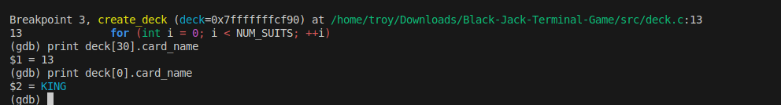
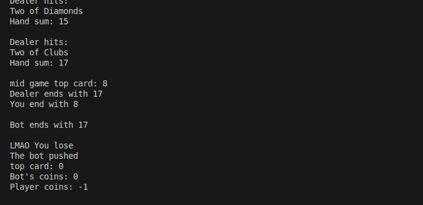
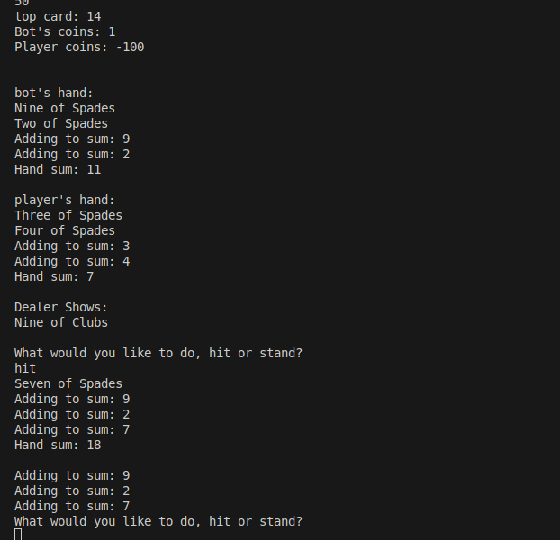
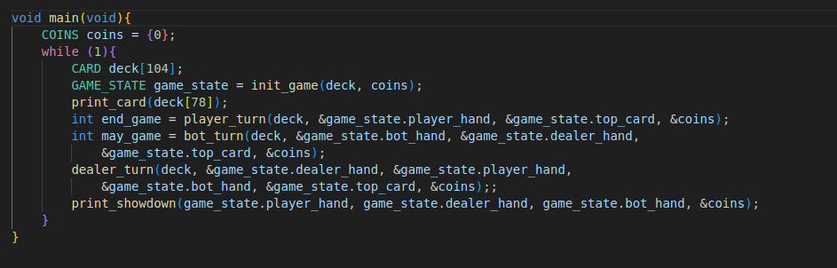

# C Project Repository Template

This is an linux terminal based two deck Blackjack game that uses ncurses to improve the UI. You get to play alongside a card counting bot, that was designed to put in optimal moves based on hi-lo card counting strategy. The bot will use card counting 
to determine a bet of size 1-20. Other than that the game can be expected to be played as a normal blackjack game besides the fact you have infinite money in this one (sadly is probably not true in the real world).

I used print debugging along with GDB debugging during my test. However, print debugging was found much more useful for this application as the application was print based and most of the bugs I got were values not coming out right, so simply seeing the values at certain times was usually enough to tell me where it went wrong. One case that GDB was more useful was while debugging creating a second deck as I was seeing there was an abnornmal amount of King of Diamonds being created. I wanted to see where the create_deck function started breaking, but I did not want to add a print loop for every card as there was 104 cards total and it would be hard to tell what part of the loop was running when the bad cards started being made. So, I used breakpoints in the loop to let me know what part of the loops the code was breaking. Below I have document picture of me using GDB as well as other print debugging statements:

This is where I was going through loops with GDB.

 

Printing what the top card was and the game progressed to see what function called was breaking it

 

Printed all the values that were being added to hand sum to see if they matched the cards that was in hand

 

After deck was created I checked a random card to make sure it was not Kind of Diamonds (there as a bug where half the deck was king of diamonds).

 

Sources:

I looked at a public Github https://github.com/jonwho/Console-Blackjack-in-C/blob/master/Blackjack.c to see how other people created a deck, and got some ideas on how to do itself

I learned how to use ncurses using the Youtube series linked with: https://www.youtube.com/watch?v=lV-OPQhPvSM&list=PL2U2TQ__OrQ8jTf0_noNKtHMuYlyxQl4v

ChatGPT: ChatGPT had its uses for the project that included how to embed images into this ReadMe, how to use rand() that was used to shuffle the deck, and the two switch cases card_name_string and card_suit_string as they were tedious to write out myself and saw it could save me some time and was not worried it would break any logic as they are pretty simple switch cases just a lot of writing. I also used it to find the function that lets you use criterion assertions with integers (we only used doubles and strings in class that I could find). 

